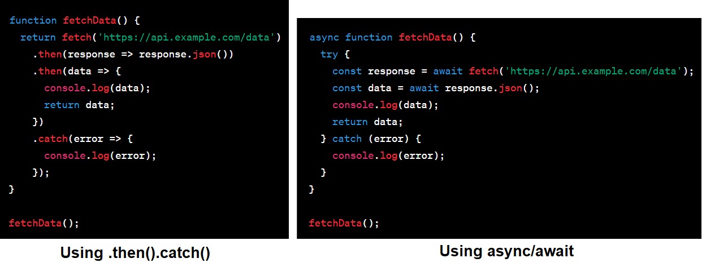

# Async/await

## Giới thiệu

- Trong JavaScript, `async` và `await` là hai từ khóa được sử dụng để làm việc với các hàm bất đồng bộ (asynchronous functions). Cụ thể:

#### async

- Từ khóa `async` được sử dụng để khai báo một hàm bất đồng bộ.
- Khi một hàm được khai báo với từ khóa `async`, nó sẽ luôn trả về một Promise.
- Nếu trong hàm async có một câu lệnh `return`, giá trị được trả về từ hàm đó sẽ trở thành giá trị được giải quyết của Promise.
- Hàm này có thể chứa từ khóa `await`, giúp JavaScript đợi cho đến khi một Promise được giải quyết (resolved).

#### await

- Từ khóa `await` chỉ có thể được sử dụng bên trong một hàm được khai báo với từ khóa `async`.
- Khi sử dụng `await` trong một hàm `async`, JavaScript sẽ tạm dừng việc thực thi của hàm cho đến khi Promise được giải quyết. Nó giúp code bất đồng bộ trở nên dễ đọc hơn, vì nó cho phép viết mã theo kiểu tuần tự, thay vì sử dụng callback hoặc Promise chaining.
- Sau `await` phải là một Promise hoặc một function return Promise.
- Ta dùng try/catch để xử lý lỗi nếu Promise ở `await` reject error.



## Một số ví dụ về sử dụng async/await

- Ví dụ cơ bản về `async/await:`

```js
const executeAsync = async () => {
  const data = new Promise((resolve, reject) => {
    setTimeout(() => {
      resolve("Hello World");
    }, 3000);
  });
  const result = await data; // "await data" will return the value that we passed to resolve
  console.log(result);
};
executeAsync();
```

- Sử dụng `async/await` để in các số từ 1 -> 10, mỗi lần in cách nhau 1s:

```js
const delay = (ms) =>
  new Promise((resolve) => {
    setTimeout(() => {
      resolve("");
    }, ms);
  });

const play = async () => {
  for (let i = 1; i <= 10; i++) {
    await delay(1000);
    console.log(i);
  }
};

play();
```

- Sử dụng `async/await` kết hợp với `Promise.all()` để lấy dữ liệu nhiều người dùng trên github:

```js
const fetchGithubInfo = async (url) => {
  const response = await fetch(url);
  const githubInfo = await response.json();
  return {
    id: githubInfo.id,
    name: githubInfo.name,
    email: githubInfo.email,
  };
};

const fetchUsersInfo = (userNameList) => {
  const requests = userNameList.map((userName) => {
    const url = `https://api.github.com/users/${userName}`;
    return fetchGithubInfo(url);
  });
  return Promise.all(requests);
};

fetchUsersInfo(["minhchi1509", "leephan2k1", "thanhyou00"]).then((data) => {
  console.log(data);
});
```

- Sử dụng `try/catch` để xử lý lỗi trong `async/await`:

```js
const promiseCreator = (ms, value) => {
  return new Promise((resolve, reject) => {
    let ok = false;
    setTimeout(() => {
      if (ok) resolve(value);
      else reject("DATA NOT FOUND");
    }, ms);
  });
};
const executeAsync = async () => {
  let data = [];
  for (let i = 1; i <= 10; i++) {
    try {
      const result = await promiseCreator(1000, i);
      data.push(result);
    } catch (error) {
      return error;
    }
  }
  return data;
};
executeAsync().then((data) => console.log(data));
// Output: DATA NOT FOUND
```
